# Context Engineering: Building AI-Native Repositories

## A 15-Minute Engineering Tech Talk (+ Q&A)

**Speaker Notes Format:** Each slide section includes timing, speaking notes, and Mermaid diagrams ready for live rendering.

---

## Slide 1: Title — "Your Repo Is Fighting Your AI Agents" _(1 min)_

> **Speaking Notes:**
> "How many of you use Copilot or another AI coding agent daily? And how often does it get things _wrong_ — compiles fine, but violates your conventions? Vercel measured this: baseline repos get 53% task success. Repos with a few simple files hit 100%. Today I'll show you exactly which files to add, what to put in them, and you can do it this afternoon. Let's start with the practical steps."

---

## Slide 2: The Essential Files — Your AI Agent Toolkit _(2 min)_

> **Speaking Notes:**
> "Four files — that's all you need to get started. **AGENTS.md** at your repo root — every major AI agent reads it: Copilot, Devin, Cursor, Windsurf. It's your project's instruction manual for AI. **copilot-instructions.md** — GitHub Copilot specifically looks for this; it's always injected into the system prompt. **Scoped instruction files** — glob-matched rules so your React conventions only apply to .tsx files. And **Skills and Prompts** — reusable workflows and team-shared prompt templates. Let me show you what goes in each one."

---

## Slide 3: What Goes in AGENTS.md _(1 min)_

> **Speaking Notes:**
> "What goes in AGENTS.md? Five sections. Project overview — one sentence. Setup commands — in execution order. Code style — your non-obvious conventions. Testing requirements. And common pitfalls — the things that burn people. Critical rule: keep it under 2 pages. Vercel proved that an 8KB compressed index beat 40KB of full docs. Concise beats comprehensive every time."

---

## Slide 4: The 15-Minute Audit _(2 min)_

> **Speaking Notes:**
> "Here's your action plan — you can do this during lunch. Four phases, 15 minutes total. Phase 1: create AGENTS.md with your commands. Phase 2: scope framework rules with glob patterns. Phase 3: structure your documentation. Phase 4: verify by actually _asking_ your agent questions and confirming the output is correct. Commit everything. You're done. Your repo is now AI-native."

---

## Slide 5: Example Repo in Action — "acme-webapp" _(1 min)_

> **Speaking Notes:**
> "Here's what this looks like in a real repo. This is 'acme-webapp' — a typical monorepo. At the root: AGENTS.md with your project overview and commands. In .github: copilot-instructions.md for global standards, scoped instruction files for React and Python, pre-made prompts your whole team can share, and a skills folder for reusable agent workflows — things like 'run-code-review' or 'migrate-database'. Each package has its own AGENTS.md for domain-specific rules. The .github folder is the right home for these — it works across Copilot, Windsurf, Cursor, and any other agent that follows the spec."

---

## Slide 6: Parametric vs. Grounded Knowledge — Why This Works _(1.5 min)_

> **Speaking Notes:**
> "Now you know _what_ to do — let me explain _why_ it works. Every AI agent has two knowledge sources. _Parametric_ — what it learned in training. _Grounded_ — what's in your repo right now. Your private APIs, your naming conventions — none of that is in the training data. When agents can't find grounded context, they guess _confidently_. The files we just set up provide that grounded context so the agent stops guessing."

---

## Slide 7: Passive vs. Active Context — Why Passive Wins _(2 min)_
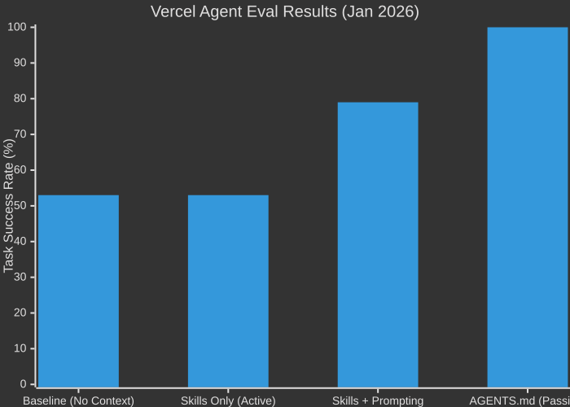

> **Speaking Notes:**
> "There are two ways to get context to an agent. _Passive_ — you push it, it's always in the prompt. _Active_ — the agent pulls it by searching. The problem with active? Vercel found agents skip docs **44% of the time** because they think they already know the answer. Skills alone — same 53% as baseline. With explicit prompting: 79%. But a compressed 8KB AGENTS.md in the prompt? **100% success rate.** Passive removes the decision point. The agent can't skip what's already in its prompt."

---

## Slide 8: Research Snapshot — What the Data Says _(1.5 min)_
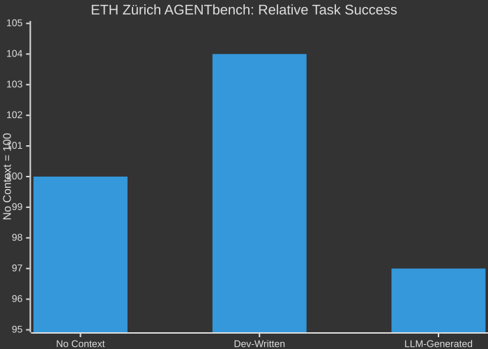

> **Speaking Notes:**
> "Let's be honest about the research. Vercel showed 53% to 100% — dramatic. ETH Zürich found marginal success-rate impact in a rigorous study. The reconciliation is simple: **context files matter most when knowledge is absent from training data.** Vercel tested _new_ APIs. ETH tested known tasks. Practical takeaway: don't auto-generate these files with an LLM — encode your _tribal knowledge_, the stuff not in any documentation. That's where the ROI is."

---

## Slide 9: The Five Pillars of AI-Native Repos _(1 min)_

> **Speaking Notes:**
> "Five pillars frame the whole approach. **Unified Knowledge** — AGENTS.md plus copilot-instructions. **Scoped Precision** — glob-matched rules per framework. **Monorepo Mastery** — nested files with nearest-file precedence. **AI-Readable Docs** — structured headings. **Living Maintenance** — quarterly audits. You already know how to do the first three from the audit slide. Pillars 4 and 5 are your this-week and this-month work."

---

## Slide 10: Maturity Model & Call to Action _(2 min)_

> **Speaking Notes:**
> "Where is your repo today? Most teams are at Level 1 — it builds and tests run. Getting to Level 2 takes 15 minutes. Level 3 takes an afternoon. That's where the biggest ROI is. Three time horizons: **Today** — create AGENTS.md, add copilot-instructions, run the audit. **This week** — scope framework rules, measure before/after. **This month** — explore Skills and MCP, set up quarterly audits. The difference is night and day. Questions?"

---

## Slide 11: References

> (No diagram — text-only slide)

- **Vercel Blog:** _AGENTS.md outperforms skills in our agent evals_ (Jan 27, 2026) — https://vercel.com/blog/agents-md-outperforms-skills-in-our-agent-evals
- **arXiv 2602.11988:** _Evaluating AGENTS.md: Are Repository-Level Context Files Helpful for Coding Agents?_ — https://arxiv.org/abs/2602.11988
- **AGENTS.md Official Specification** — https://agents.md/
- **GitHub Docs:** _Adding custom instructions for GitHub Copilot_ — https://docs.github.com/copilot/customizing-copilot/adding-custom-instructions-for-github-copilot
- **Anthropic:** _The Complete Guide to Building Skills for Claude_ — https://platform.claude.com/docs/en/agents-and-tools/agent-skills/best-practices
- **GitHub Blog:** _How to write a great agents.md_ — https://github.blog/ai-and-ml/github-copilot/how-to-write-a-great-agents-md-lessons-from-over-2500-repositories/

---

## Appendix A: Context Rot — The Silent Killer

> **Speaking Notes:**
> "Even with million-token context windows, there's a ticking time bomb: _context rot_. As the window fills, agents silently auto-compact. Your project conventions — the first things discarded. The agent doesn't tell you. The code compiles. Tests might pass. But it violates your architecture. This is why we need _structured_ context, not just throwing everything into the window."

---

## Appendix B: Anthropic's Progressive Disclosure

> **Speaking Notes:**
> "Anthropic's Skills framework is the gold standard for progressive disclosure. Level 1 — just the YAML frontmatter, about 100 tokens — is _always_ in the system prompt. Level 2 — the full SKILL.md body — loads only on match. Level 3 — reference files — load on demand. Hundreds of skills, minimal token overhead."

---

## Appendix C: MCP + Skills Architecture

> **Speaking Notes:**
> "MCP gives you the kitchen — tools, ingredients, equipment. Skills give you the recipes. Without skills, users connect an MCP and ask 'now what?' With skills, workflows activate automatically."

---

## Appendix D: Copilot vs. Devin — Two Architectures

> **Speaking Notes:**
> "Two leading tools, two philosophies. Copilot is the _silent partner_ — low latency, IDE-native. Devin is the _autonomous engineer_ — full VM, indexes your entire codebase. They're complementary. Both read AGENTS.md."

---

## Appendix E: Monorepo Routing — Nearest-File Precedence

> **Speaking Notes:**
> "In monorepos, nearest-file precedence is everything. The root AGENTS.md acts as a router. Each package has its own. Zero context leakage between domains."

---

## Appendix F: The Hybrid Strategy Stack

> **Speaking Notes:**
> "Five layers from foundation to large-scale navigation. Build from the bottom up. Most teams only need the first two layers to see massive improvements."

---

## Appendix G: The Passive Steering Workflow
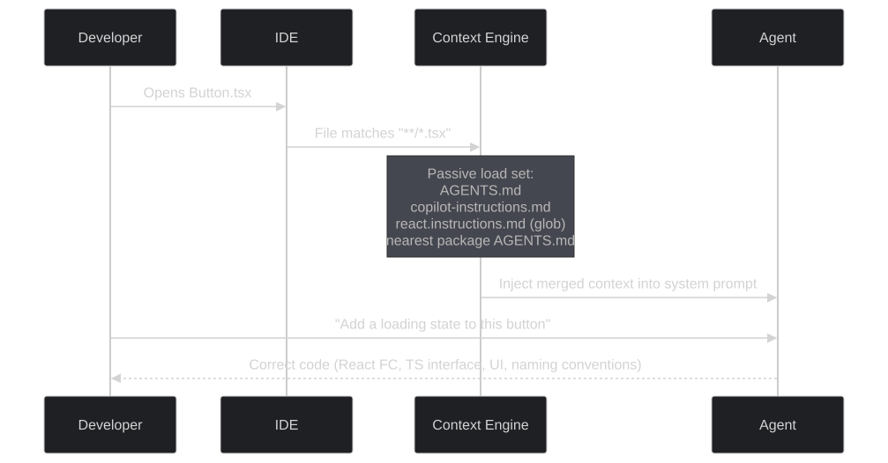

> **Speaking Notes:**
> "Developer opens a TSX file. The context engine silently matches globs, loads the nearest AGENTS.md, merges everything. By the time the developer types a request, the agent already has every convention. No searching. No guessing."

---

## Appendix H: The Complete Context Architecture

> **Speaking Notes:**
> "The complete architecture: three layers feeding into the agent. Passive context — always in the prompt. Active retrieval — on-demand. Skills — progressive disclosure. Together: deterministic, convention-compliant code."

---

## Appendix I: Key Metrics Summary
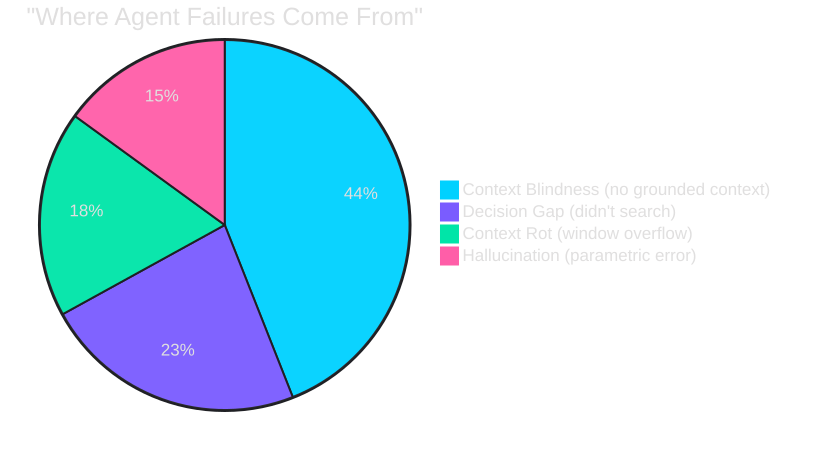

---

## Appendix J: Context File Impact by Scenario
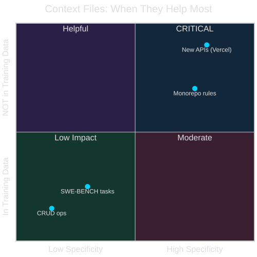

---

## Appendix K: Full Presentation Timeline

---

## Key Citations

- **Vercel Blog:** _AGENTS.md outperforms skills in our agent evals_ (Jan 27, 2026) — https://vercel.com/blog/agents-md-outperforms-skills-in-our-agent-evals
- **arXiv 2602.11988:** _Evaluating AGENTS.md: Are Repository-Level Context Files Helpful for Coding Agents?_ — https://arxiv.org/abs/2602.11988
- **AGENTS.md Official Specification** — https://agents.md/
- **GitHub Docs:** _Adding custom instructions for GitHub Copilot_ — https://docs.github.com/copilot/customizing-copilot/adding-custom-instructions-for-github-copilot
- **Anthropic:** _The Complete Guide to Building Skills for Claude_ — https://platform.claude.com/docs/en/agents-and-tools/agent-skills/best-practices
- **GitHub Blog:** _How to write a great agents.md_ — https://github.blog/ai-and-ml/github-copilot/how-to-write-a-great-agents-md-lessons-from-over-2500-repositories/

---

_Tech Talk: "Context Engineering: Building AI-Native Repositories" — ~15 minutes with 11 main slides + 11 appendix slides, 20+ Mermaid diagrams. Designed for Q&A time._
