# Context Engineering: Building AI-Native Repositories

## A 20-Minute Engineering Tech Talk

**Speaker Notes Format:** Each slide section includes timing, speaking notes, and Mermaid diagrams ready for live rendering.

---

## Slide 1: Title — "Your Repo Is Fighting Your AI Agents" _(2 min)_

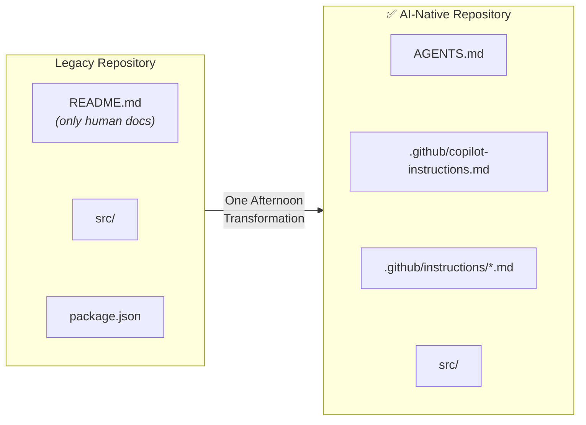

> **Speaking Notes:**
> "70% of AI coding tasks still fail in real-world repos — not because the models are bad, but because the _context_ is wrong. Vercel proved it: baseline repos achieve 53% task success. AI-native repos hit 100%. Today I'll show you the exact engineering blueprint to get there. You can implement it this afternoon."

---

## Slide 2: The Core Problem — Parametric vs. Grounded Knowledge _(3 min)_

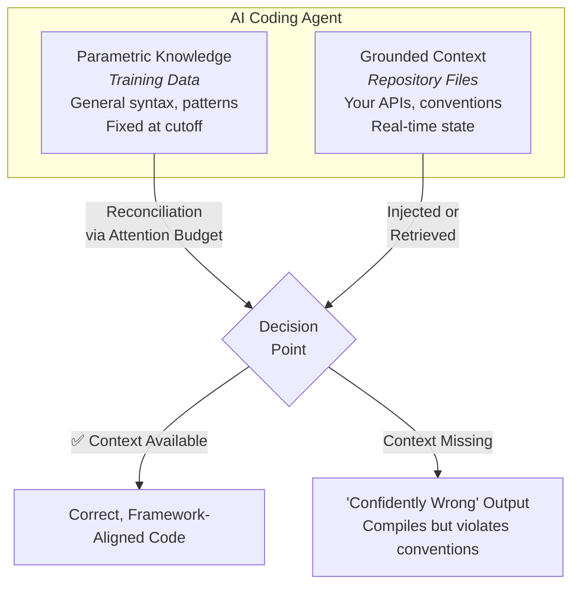

> **Speaking Notes:**
> "Every AI agent has two knowledge sources. _Parametric_ — what it learned in training. _Grounded_ — what's in your repo right now. The problem? Parametric knowledge is stale and generic. Your private APIs, your naming conventions, your monorepo structure — none of that is in the training data. When agents can't find grounded context, they guess. And they guess _confidently_. Vercel found agents skip framework docs 44% of the time because they think they already know the answer."

---

## Slide 3: Context Rot — The Silent Killer _(2 min)_

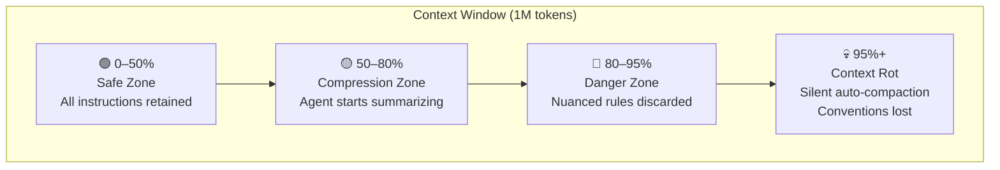

> **Speaking Notes:**
> "Even with million-token context windows, there's a ticking time bomb: _context rot_. As the window fills, agents silently auto-compact. Your project conventions — the first things discarded. The agent doesn't tell you. The code compiles. Tests might pass. But it violates your architecture. This is why we need _structured_ context, not just throwing everything into the window."

---

## Slide 4: Two Models of Context Delivery _(3 min)_

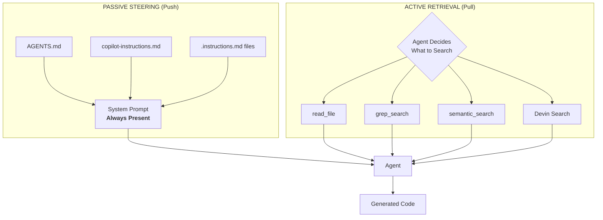

> **Speaking Notes:**
> "There are exactly two ways to get context to an agent. _Passive_ — you push it. It's always in the prompt. The agent never decides whether to look for it. _Active_ — the agent pulls it on demand by searching your codebase. Both have trade-offs. Passive wins reliability. Active wins scale. The key insight from Vercel: **passive eliminates the Decision Gap**. The agent can't skip what's already in its prompt."

---

## Slide 5: The Decision Gap — Why Passive Wins _(2 min)_

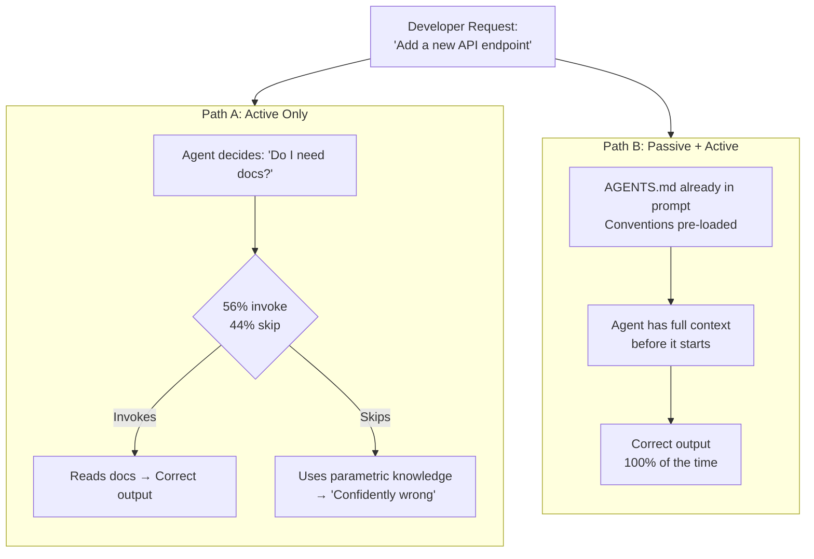

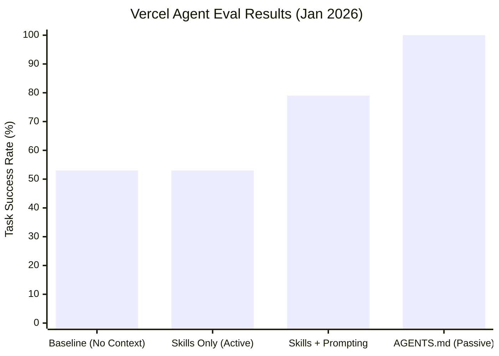

> **Speaking Notes:**
> "This is the most important slide. Vercel tested teaching agents Next.js 16 APIs — knowledge _absent_ from training data. Skills alone? 53% — same as baseline, because agents only invoked them 56% of the time. Even with explicit prompting: 79%. But a compressed 8KB AGENTS.md passive index? **100% success rate.** The passive file removed the decision point entirely."

---

## Slide 6: The Five Pillars of AI-Native Repos _(3 min)_

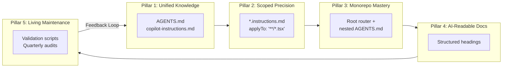

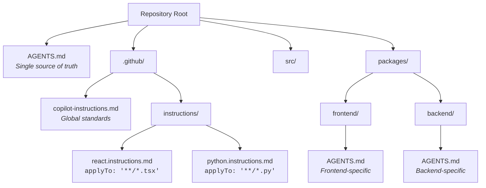

> **Speaking Notes:**
> "Five pillars. **Unified Knowledge** — one AGENTS.md at root, one copilot-instructions.md. **Scoped Precision** — glob-matched instruction files so React rules only apply to .tsx files. **Monorepo Mastery** — nested AGENTS.md with nearest-file precedence. **AI-Readable Docs** — structured headings. **Living Maintenance** — audit scripts that verify your context files are still accurate. This tree is what your repo should look like when you're done."

---

## Slide 7: Deep Dive — Anthropic's Progressive Disclosure _(2 min)_

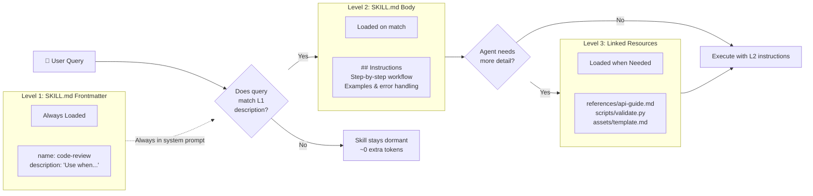

> **Speaking Notes:**
> "Anthropic's Skills framework is the gold standard for progressive disclosure. Level 1 — just the YAML frontmatter, about 100 tokens — is _always_ in the system prompt. It tells Claude _when_ to activate the skill. Level 2 — the full SKILL.md body — loads only when there's a match. Level 3 — reference files and scripts — load only on demand. You can have hundreds of skills installed with minimal token overhead. This is how you scale expertise without bloating context."

---

## Slide 8: The MCP + Skills Architecture _(1 min)_

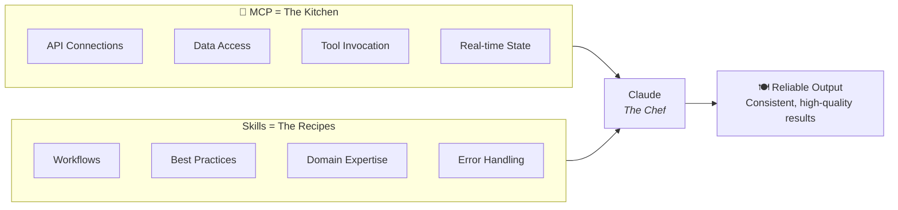

> **Speaking Notes:**
> "Anthropic uses the kitchen analogy. MCP gives you the kitchen — tools, ingredients, equipment. Skills give you the recipes — _how_ to use those tools effectively. Without skills, users connect an MCP and ask 'now what?' With skills, workflows activate automatically. This is the architecture for scaling AI-powered workflows."

---

## Slide 9: Copilot vs. Devin — Two Architectures _(2 min)_


> **Speaking Notes:**
> "Two leading tools, two opposite philosophies. Copilot is the _silent partner_ — low latency, surgically precise, lives in your IDE. Devin is the _autonomous engineer_ — give it a task, it spins up a VM, indexes your entire codebase, and works independently. They're complementary. Use Copilot for real-time flow. Use Devin for large-scale refactors. Both read AGENTS.md. Both benefit from the five pillars."

---

## Slide 10: The Academic Reality Check _(2 min)_

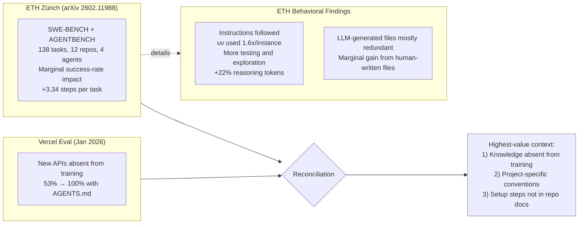

> **Speaking Notes:**
> "Let's be honest about the research. Vercel showed dramatic gains — 53% to 100%. But ETH Zürich's rigorous academic study found marginal effects. How do we reconcile this? **Context matters most when knowledge is absent from training.** Vercel tested _new_ APIs. ETH tested tasks where info already existed. The practical takeaway: don't auto-generate AGENTS.md with an LLM — those are redundant. Write it yourself. Encode your _tribal knowledge_: the stuff that's not in any documentation."

---

## Slide 11: Monorepo Routing — Nearest-File Precedence _(1 min)_

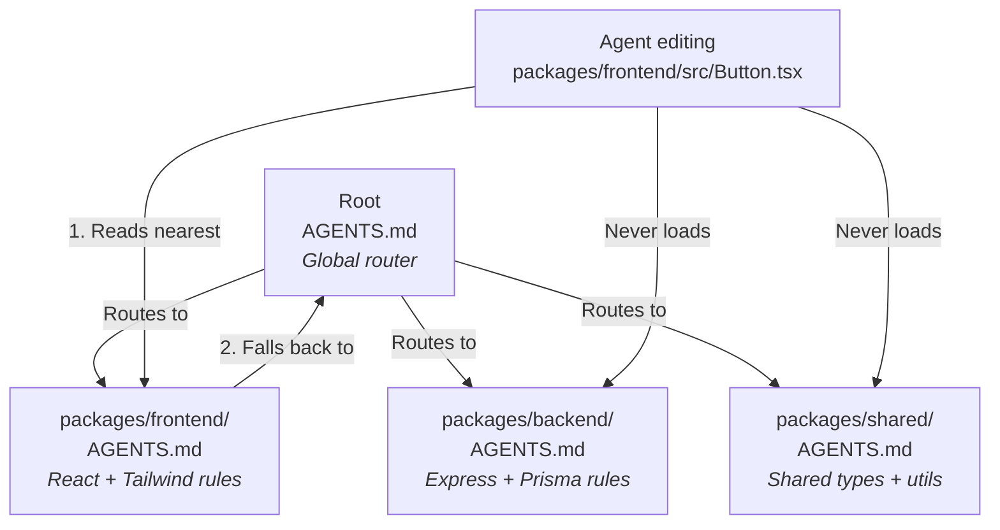

> **Speaking Notes:**
> "In monorepos, nearest-file precedence is everything. The root AGENTS.md acts as a router. Each package has its own. When an agent edits `packages/frontend/src/Button.tsx`, it reads `packages/frontend/AGENTS.md` first, then falls back to root. It _never_ loads backend or shared rules. Zero context leakage. This is how you prevent the agent from applying Express conventions to your React components."

---

## Slide 12: The Hybrid Strategy Stack _(1 min)_

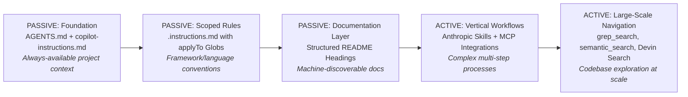

> **Speaking Notes:**
> "Here's the stack. Foundation is passive — always present. Scoped rules are passive — loaded per file type. Documentation is passive — discoverable. Then active layers: Skills and MCP for complex workflows, and search tools for navigating massive codebases. Build from the bottom up. Most teams only need the first two layers to see massive improvements."

---

## Slide 13: The Passive Steering Workflow _(1 min)_

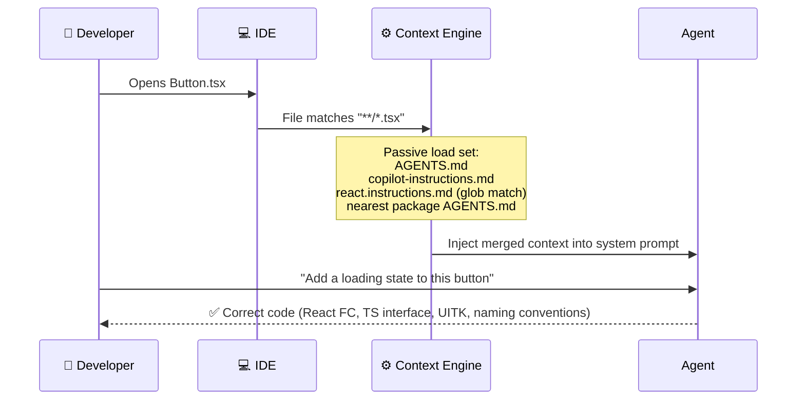

> **Speaking Notes:**
> "Here's the flow in practice. Developer opens a TSX file. The context engine silently matches globs, loads the nearest AGENTS.md, merges copilot-instructions.md and the scoped React rules. By the time the developer types a request, the agent already has every convention in its prompt. No searching. No guessing. Deterministic output."

---

## Slide 14: Repository Readiness Maturity Model _(1 min)_

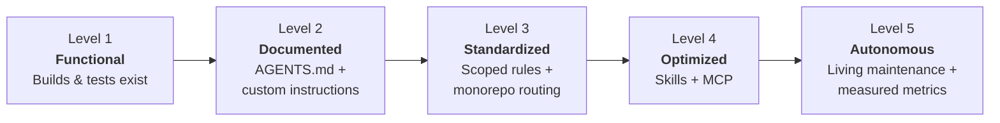

> **Speaking Notes:**
> "Where is your repo today? Level 1 — it builds and tests run. Level 2 — you've added AGENTS.md. Level 3 — scoped instructions and monorepo routing. Level 4 — Skills and MCP integrations. Level 5 — living maintenance with measured metrics. Most teams are at Level 1. Getting to Level 2 takes 15 minutes. Getting to Level 3 takes an afternoon. That's where the biggest ROI is."

---

## Slide 15: The 15-Minute Audit _(2 min)_

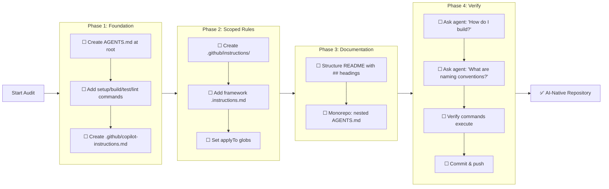

> **Speaking Notes:**
> "Here's your action plan. Four phases, 15 minutes total. Phase 1: create AGENTS.md with your commands. Phase 2: scope framework rules with glob patterns. Phase 3: structure documentation. Phase 4: verify by actually asking your agent questions and confirming correctness. Commit everything. You're done. Your repo is now AI-native."

---

## Slide 16: What Goes in AGENTS.md _(1 min)_


> **Speaking Notes:**
> "What goes in AGENTS.md? Five sections. Project overview — one sentence. Setup commands — in execution order. Code style — your non-obvious conventions. Testing requirements. And common pitfalls — the things that burn people. Critical rule: keep it under 2 pages. Concise beats comprehensive. An 8KB compressed index beat 40KB of full docs in Vercel's eval."

---

## Slide 17: The Complete Context Architecture _(1 min)_

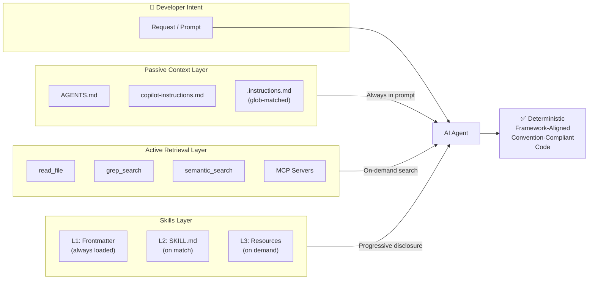

> **Speaking Notes:**
> "Here's the complete architecture. Three layers feeding into the agent. Passive context — always in the prompt, zero decision points. Active retrieval — on-demand tools for scale. Skills — Anthropic's progressive disclosure for complex workflows. Together, they produce deterministic, framework-aligned, convention-compliant code. This is context engineering."

---

## Slide 18: Key Takeaways & Call to Action _(2 min)_

```mermaid
graph LR
    subgraph Today["Do Today"]
        direction LR
        T1["1. Create AGENTS.md"]
        T2["2. Add copilot-instructions.md"]
        T3["3. Run the 15-min audit"]
    end

    subgraph Week["📅 This Week"]
        direction LR
        W1["4. Scope framework rules"]
        W2["5. Add monorepo routing"]
        W3["6. Measure before/after"]
    end

    subgraph Month["📊 This Month"]
        direction LR
        M1["7. Explore Skills/MCP"]
        M2["8. Set up quarterly audits"]
        M3["9. Track CI pass rates"]
    end

    Today --> Week --> Month
```

> **Speaking Notes:**
> "Three time horizons. **Today** — 15 minutes — create AGENTS.md, add copilot-instructions.md, run the audit. **This week** — scope your framework rules, add monorepo routing, measure the before/after. **This month** — explore Skills and MCP, set up quarterly audits, start tracking CI pass rates. The difference is night and day. Once the repo is shaped correctly, AI agents stop guessing and start delivering."

---

## Appendix A: Key Metrics Summary

```mermaid
pie title "Where Agent Failures Come From"
    "Context Blindness (no grounded context)" : 44
    "Decision Gap (didn't search)" : 23
    "Context Rot (window overflow)" : 18
    "Hallucination (parametric error)" : 15
```

---

## Appendix B: Context File Impact by Scenario

```mermaid
quadrantChart
    title Context Files: When They Help Most
    x-axis "Low Project Specificity" --> "High Project Specificity"
    y-axis "Knowledge in Training Data" --> "Knowledge NOT in Training Data"
    quadrant-1 "CRITICAL: Write AGENTS.md"
    quadrant-2 "Helpful: Add conventions"
    quadrant-3 "Low impact: Generic tasks"
    quadrant-4 "Moderate: Tribal knowledge"
    "Next.js 16 APIs (Vercel)": [0.8, 0.9]
    "SWE-BENCH tasks": [0.4, 0.3]
    "Private API conventions": [0.9, 0.5]
    "Standard CRUD ops": [0.2, 0.2]
    "Monorepo routing": [0.85, 0.65]
    "Custom test patterns": [0.7, 0.55]
```

---

## Appendix C: Full Presentation Timeline

```mermaid
flowchart LR
    O["OPENING (7 min)<br/>• Title & Hook (2)<br/>• Parametric vs Grounded (3)<br/>• Context Rot (2)"]
    C["CORE CONCEPTS (5 min)<br/>• Push vs Pull Models (3)<br/>• Decision Gap & Vercel (2)"]
    A["ARCHITECTURE (8 min)<br/>• Five Pillars (3)<br/>• Progressive Disclosure (2)<br/>• MCP + Skills (1)<br/>• Copilot vs Devin (2)"]
    E["EVIDENCE & ACTION (5 min)<br/>• Academic Reality Check (2)<br/>• Monorepo Routing (1)<br/>• Hybrid Stack (1)<br/>• Passive Steering Flow (1)"]
    X["CLOSING (7 min)<br/>• Maturity Model (1)<br/>• 15-Min Audit (2)<br/>• AGENTS.md Content (1)<br/>• Complete Architecture (1)<br/>• Takeaways & CTA (2)"]

    O --> C --> A --> E --> X
```

---

## Key Citations

- **Vercel Blog:** _AGENTS.md outperforms skills in our agent evals_ (Jan 27, 2026) — https://vercel.com/blog/agents-md-outperforms-skills-in-our-agent-evals
- **arXiv 2602.11988:** _Evaluating AGENTS.md: Are Repository-Level Context Files Helpful for Coding Agents?_ — https://arxiv.org/abs/2602.11988
- **AGENTS.md Official Specification** — https://agents.md/
- **GitHub Docs:** _Adding custom instructions for GitHub Copilot_ — https://docs.github.com/copilot/customizing-copilot/adding-custom-instructions-for-github-copilot
- **Anthropic:** _The Complete Guide to Building Skills for Claude_ — https://platform.claude.com/docs/en/agents-and-tools/agent-skills/best-practices
- **GitHub Blog:** _How to write a great agents.md_ — https://github.blog/ai-and-ml/github-copilot/how-to-write-a-great-agents-md-lessons-from-over-2500-repositories/

---

_Tech Talk: "Context Engineering: Building AI-Native Repositories" — ~20 minutes with 18 slides and 20+ Mermaid diagrams._
