# Context Engineering: Building AI-Native Repositories

## A 15-Minute Engineering Tech Talk (+ Q&A)

**Speaker Notes Format:** Each slide section includes timing, speaking notes, and Mermaid diagrams ready for live rendering.

---

## Slide 1: Title — "Your Repo Is Fighting Your AI Agents" _(1 min)_

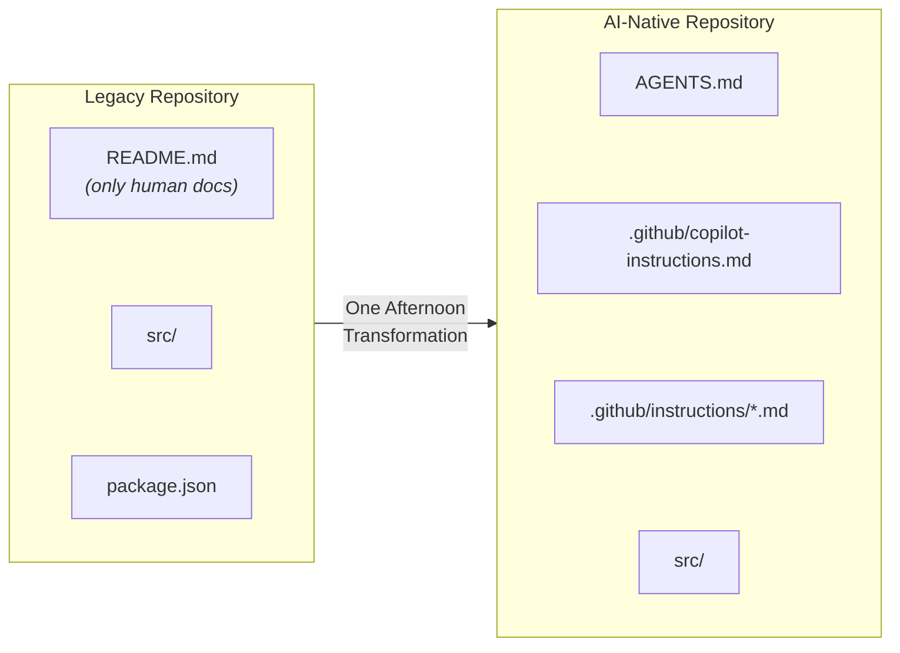

> **Speaking Notes:**
> "How many of you use Copilot or another AI coding agent daily? And how often does it get things _wrong_ — compiles fine, but violates your conventions?
>
> Look at the diagram. On the left — a legacy repository. README.md written for humans, your source code, package.json. That's what 70% of repos look like today. On the right — an AI-native repository. Three files added: AGENTS.md at the root, copilot-instructions.md for global standards, and scoped instruction files for framework-specific rules. Same source code, same project — just a few files that tell the agent how your team actually works.
>
> Vercel measured this: legacy repos get 53% task success. Add those files and you hit 100%. The transformation takes one afternoon. Today I'll show you exactly which files to add, what to put in them, and you can do it before your next standup."

---

## Slide 2: The Essential Files — Your AI Agent Toolkit _(2 min)_

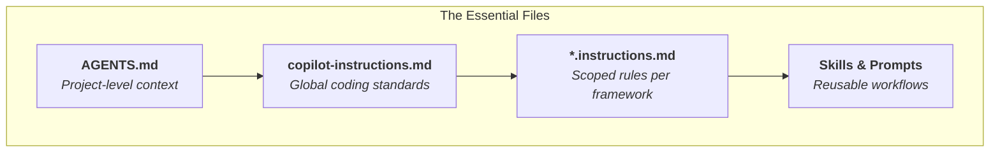

> **Speaking Notes:**
> "Four files — that's the toolkit. Let me walk through each one.
>
> First, **AGENTS.md** — this lives at your repo root. It's the single most impactful file you can add. Every major AI coding agent reads it: GitHub Copilot, Devin, Cursor, Windsurf. Think of it as your project's instruction manual for AI — setup commands, conventions, pitfalls. Vercel proved this one file alone took task success from 53% to 100%.
>
> Second, **copilot-instructions.md** — this lives at `.github/copilot-instructions.md`. GitHub Copilot specifically looks for this file and always injects it into the system prompt. Use it for global coding standards that apply everywhere: naming conventions, import ordering, error handling patterns.
>
> Third, **scoped instruction files** — these are `.instructions.md` files inside `.github/instructions/`. Each one has an `applyTo` glob pattern. So you can have `react.instructions.md` with `applyTo: '**/*.tsx'` for React conventions, and `python.instructions.md` with `applyTo: '**/*.py'` for Python rules. The agent only loads the rules relevant to the file you're editing.
>
> Fourth, **Skills and Prompts** — these live in `.github/skills/` and `.github/prompts/`. In `.github/`: `copilot-instructions.md`, `instructions/`, `prompts/`, and `skills/`. Skills are multi-step workflows the agent can execute — like 'run a code review' or 'scaffold a new API endpoint.' Prompts are team-shared templates so everyone asks the agent the same way. These are your reusable building blocks.
>
> Together, these four files give the agent everything it needs. Let me show you what goes inside each one."

---

## Slide 3: What Goes in AGENTS.md _(1 min)_

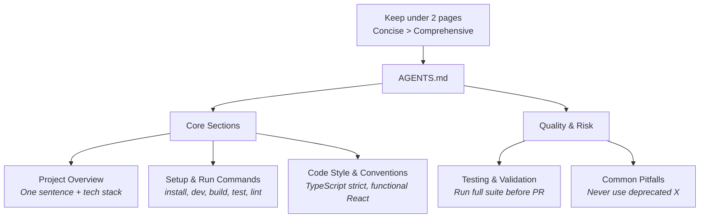

> **Speaking Notes:**
> "What goes in AGENTS.md? The diagram breaks it into two groups.
>
> **Core sections** — the essentials. First, a one-sentence project overview with your tech stack. Second, setup and run commands — install, dev, build, test, lint — in execution order so the agent can actually run your project. Third, code style and conventions — things like 'TypeScript strict mode, functional React components only.'
>
> **Quality and risk sections** — these save you from the subtle bugs. Testing and validation — 'run the full suite before any PR.' And common pitfalls — 'never use the deprecated X API, always use Y instead.'
>
> The rule at the top matters most: keep it under two pages. Vercel proved that a compressed 8KB index beat 40KB of full documentation. Why? Because concise context stays in the attention window. Verbose context gets compressed away. Encode your _tribal knowledge_ — the non-obvious stuff that burns people — and leave out anything the agent already knows from training data."

---

## Slide 4: The 15-Minute Audit _(2 min)_

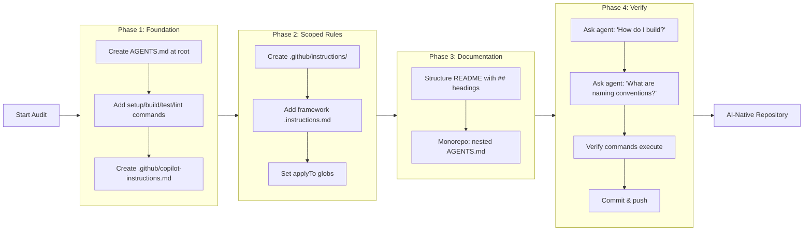

> **Speaking Notes:**
> "Here's your action plan — you can literally do this during lunch. The diagram shows four phases flowing left to right.
>
> **Phase 1: Foundation.** Create AGENTS.md at your repo root. Add your setup, build, test, and lint commands. Then create `.github/copilot-instructions.md` with your global coding standards. That's three files in five minutes.
>
> **Phase 2: Scoped Rules.** Create a `.github/instructions/` directory. Add framework-specific `.instructions.md` files — one for React, one for Python, whatever you use. Set the `applyTo` glob patterns so each file only activates for the right file types.
>
> **Phase 3: Documentation.** Structure your README with machine-readable `##` headings. If you have a monorepo, add a nested AGENTS.md in each package directory.
>
> **Phase 4: Verify.** This is the step people skip — don't. Ask your agent: 'How do I build this project?' Ask it: 'What are our naming conventions?' Verify the commands actually execute. If the answers are right, commit and push. You're done — your repo is now AI-native."

---

## Slide 5: Example Repo in Action — "acme-webapp" _(1 min)_

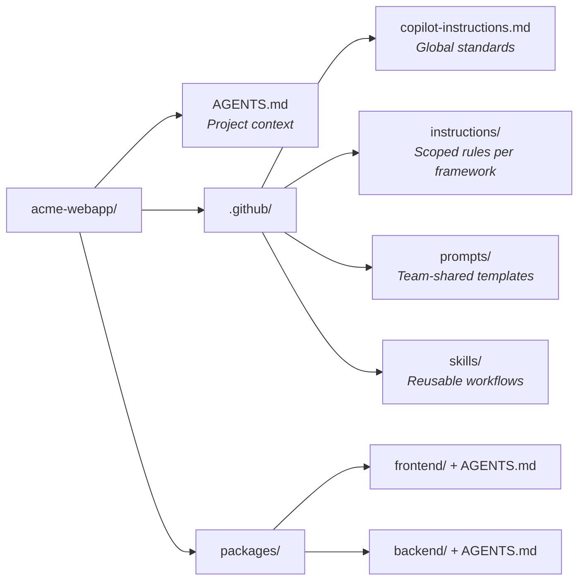

> **Speaking Notes:**
> "Here's what this looks like in a real repo. This is 'acme-webapp' — a typical monorepo. At the root: AGENTS.md with your project overview and commands. In `.github/`: `copilot-instructions.md` for global standards, `instructions/` for framework-specific instruction files, `prompts/` for team-shared templates, and `skills/` for reusable agent workflows — things like 'run-code-review' or 'migrate-database'. Each package has its own AGENTS.md for domain-specific rules. The `.github/` folder is the right home for these — it works across Copilot, Windsurf, Cursor, and any other agent that follows the spec."

---

## Slide 6: AI Agent Knowledge Flow — Leveraging Grounded Context _(1.5 min)_

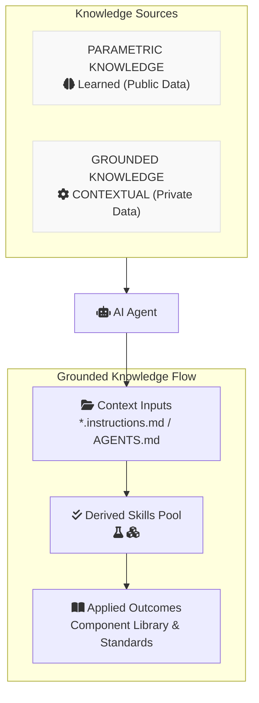

> **Speaking Notes:**
> "To understand why context engineering is so effective, we have to look at the two types of knowledge an agent uses.
>
> On the left is **Parametric Knowledge**. This is what the model learned during training from public data—React patterns, Tailwind syntax, general coding logic. It's static, general, and frozen at the training cutoff. This is the 'brain' of the agent.
>
> On the right is **Grounded Knowledge**. This is the private, project-specific context we provide. It starts with **Context Inputs** like your `agents.md` and `*.instructions.md` files. These inputs feed into a **Derived Skills Pool**—workflows and testing patterns specific to your codebase.
>
> The result is **Applied Outcomes**: a component library and repo standards guide that the agent actually follows. When we bridge the gap between what the agent 'knows' and how your project 'works', we move from 'confidently wrong' guesses to deterministic, production-ready code."

---

## Slide 8: Passive vs. Active Context — Why Passive Wins _(2 min)_

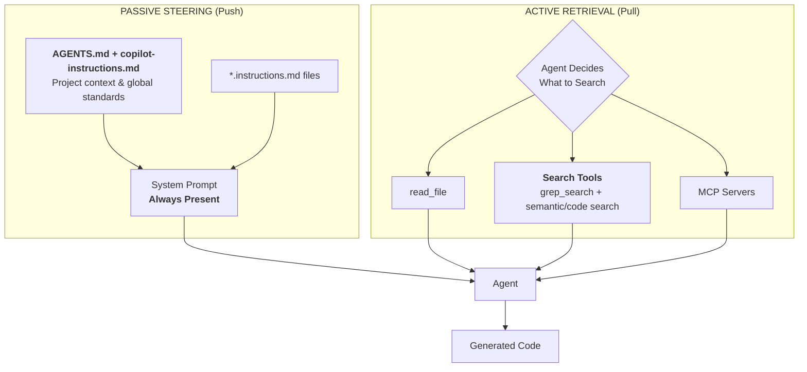

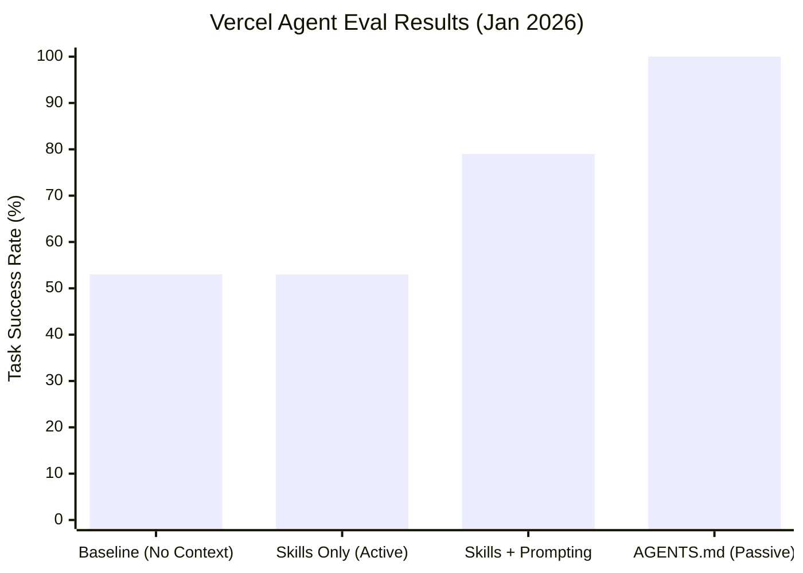

> **Speaking Notes:**
> "There are two ways to get context to an agent, and the diagram on the left shows both.
>
> **Passive steering** — the push model. Your AGENTS.md, copilot-instructions.md, and scoped `*.instructions.md` files all get injected directly into the system prompt. They're _always present_. The agent doesn't choose to load them — they're just there.
>
> **Active retrieval** — the pull model. The agent decides to search using tools like `read_file`, `grep_search`, or semantic/code search. The critical word is _decides_. There's a decision point, and Vercel found that agents skip searching **44% of the time** because they think they already know the answer.
>
> Now look at the bar chart on the right — this is Vercel's actual eval data from January 2026. Baseline with no context files: 53% task success. Skills only — that's pure active retrieval — same 53%. Skills with explicit prompting: 79%. But a compressed 8KB AGENTS.md injected passively into the prompt? **100% success rate.**
>
> The takeaway is clear: passive removes the decision point entirely. The agent can't skip what's already in its prompt."

---

## Slide 9: Research Snapshot — What the Data Says _(1.5 min)_

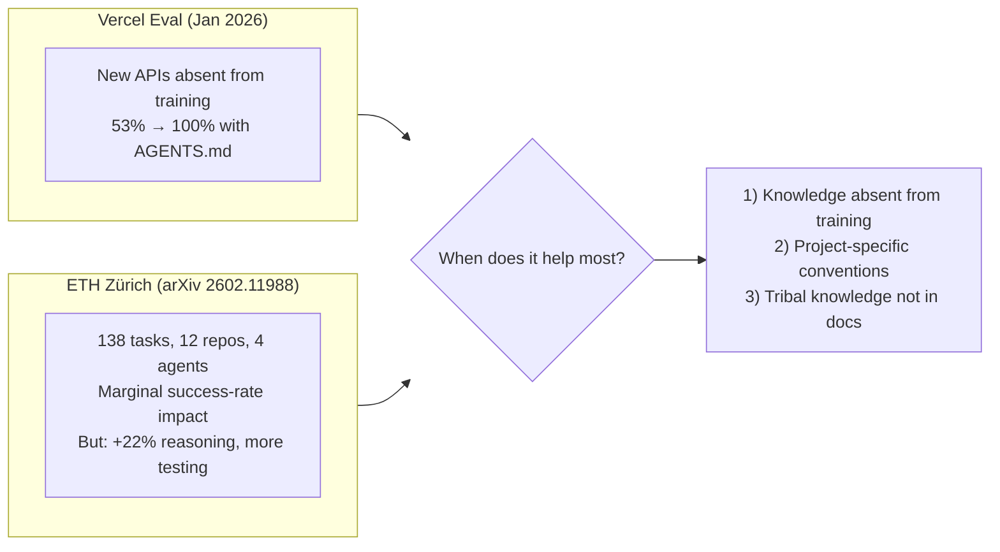

> **Speaking Notes:**
> "Let's be honest about the research — the diagram shows both sides.
>
> On the left, **Vercel's eval** from January 2026: they tested new APIs that were absent from the model's training data. Result: 53% baseline jumped to 100% with AGENTS.md. Dramatic.
>
> On the right, **ETH Zürich's rigorous study** — 138 tasks across 12 repos with 4 different agents. They found marginal success-rate impact. But here's the nuance: they saw +22% improvement in reasoning quality and agents wrote more tests.
>
> A practical interpretation is: _when does it help most?_ Three conditions — first, when knowledge is absent from training data. Second, when you have project-specific conventions the model has never seen. Third, when there's tribal knowledge that's not in any documentation.
>
> Practical takeaway: don't auto-generate AGENTS.md with an LLM — those are redundant with what's already in the training data. Write it yourself. Encode the stuff that burns people — the non-obvious decisions, the 'we tried X and it broke everything' knowledge. That's where the ROI is."

---

## Slide 10: The Five Pillars of AI-Native Repos _(1 min)_

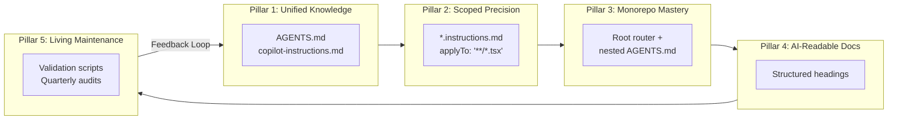

> **Speaking Notes:**
> "Five pillars frame the whole approach. **Unified Knowledge** — AGENTS.md plus copilot-instructions. **Scoped Precision** — glob-matched rules per framework. **Monorepo Mastery** — nested files with nearest-file precedence. **AI-Readable Docs** — structured headings. **Living Maintenance** — quarterly audits. You already know how to do the first three from the audit slide. Pillars 4 and 5 are your this-week and this-month work."

---

## Slide 11: Maturity Model & Call to Action _(2 min)_

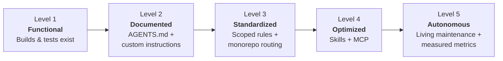

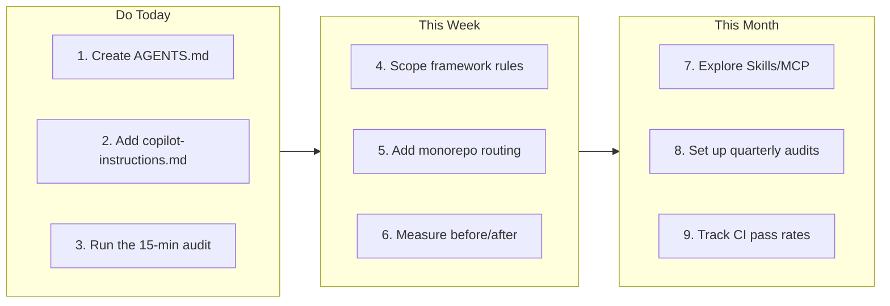

> **Speaking Notes:**
> "Where is your repo today? The maturity model shows five levels.
>
> **Level 1: Functional** — your project builds and tests exist. That's most teams right now. **Level 2: Documented** — you've added AGENTS.md and custom instructions. That takes 15 minutes. **Level 3: Standardized** — scoped rules per framework plus monorepo routing. An afternoon of work. **Level 4: Optimized** — you're using Skills and MCP integrations. **Level 5: Autonomous** — living maintenance with measured metrics and quarterly audits.
>
> The biggest ROI jump is from Level 1 to Level 3 — and you can get there today.
>
> The second diagram breaks it into three time horizons with specific action items. **Do Today, 15 minutes:** create AGENTS.md, add copilot-instructions.md, run the audit from slide 4. **This Week:** scope your framework rules with glob patterns, add monorepo routing if applicable, and measure before/after on a real task. **This Month:** explore Skills and MCP for advanced workflows, set up quarterly audits to keep files current, and start tracking CI pass rates as your success metric.
>
> The difference is night and day. Questions?"

---

## Slide 12: References

> (No diagram — text-only slide)

- **Vercel Blog:** _AGENTS.md outperforms skills in our agent evals_ (Jan 27, 2026) — https://vercel.com/blog/agents-md-outperforms-skills-in-our-agent-evals
- **arXiv 2602.11988:** _Evaluating AGENTS.md: Are Repository-Level Context Files Helpful for Coding Agents?_ — https://arxiv.org/abs/2602.11988
- **AGENTS.md Official Specification** — https://agents.md/
- **GitHub Docs:** _Adding custom instructions for GitHub Copilot_ — https://docs.github.com/copilot/customizing-copilot/adding-custom-instructions-for-github-copilot
- **Anthropic:** _The Complete Guide to Building Skills for Claude_ — https://platform.claude.com/docs/en/agents-and-tools/agent-skills/best-practices
- **GitHub Blog:** _How to write a great agents.md_ — https://github.blog/ai-and-ml/github-copilot/how-to-write-a-great-agents-md-lessons-from-over-2500-repositories/

---

## Appendix A: Context Rot — The Silent Killer

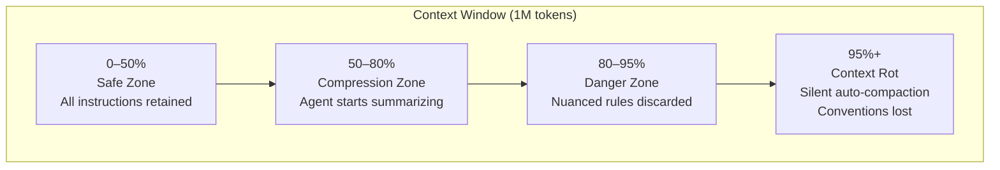

> **Speaking Notes:**
> "Even with million-token context windows, there's a ticking time bomb. The diagram shows four zones as the window fills up.
>
> **0–50% — the Safe Zone.** All your instructions are retained, everything works as expected. This is where short conversations live.
>
> **50–80% — the Compression Zone.** The agent starts silently summarizing earlier context. Your high-level instructions survive, but specific details begin to blur.
>
> **80–95% — the Danger Zone.** Nuanced rules get discarded. The agent still _sounds_ confident, but it's operating on a compressed version of your conventions.
>
> **95%+ — Context Rot.** Silent auto-compaction kicks in. Your project conventions — naming patterns, architecture rules, API preferences — are the first things lost. The code compiles. Tests might even pass. But it silently violates your architecture.
>
> This is exactly why we need _structured_ context files rather than dumping everything into a single long conversation. Passive files get re-injected fresh every turn."

---

## Appendix B: Anthropic's Progressive Disclosure

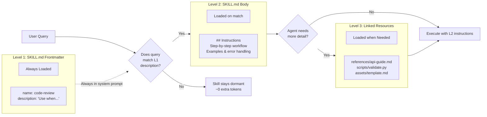

> **Speaking Notes:**
> "Anthropic's Skills framework is the gold standard for progressive disclosure. The diagram shows the complete flow.
>
> Start at the bottom left — **Level 1: SKILL.md Frontmatter.** This is just the YAML header: a name, a description, and trigger conditions. About 100 tokens. It's _always_ loaded into the system prompt, which is why it feeds into the match decision via a dotted line.
>
> When a user query comes in, the agent checks: does this query match any L1 description? If **no** — the skill stays dormant, costing zero extra tokens. If **yes** — it loads **Level 2: the SKILL.md body.** This contains the step-by-step instructions, examples, and error handling for that specific workflow.
>
> Then another decision: does the agent need more detail? If **no** — it executes with what it has. If **yes** — it loads **Level 3: linked resources** like reference docs, validation scripts, and templates.
>
> The beauty is you can have _hundreds_ of skills and only pay tokens for the ones that activate. This is the model for how `.github/skills/` should be structured."

---

## Appendix C: MCP + Skills Architecture

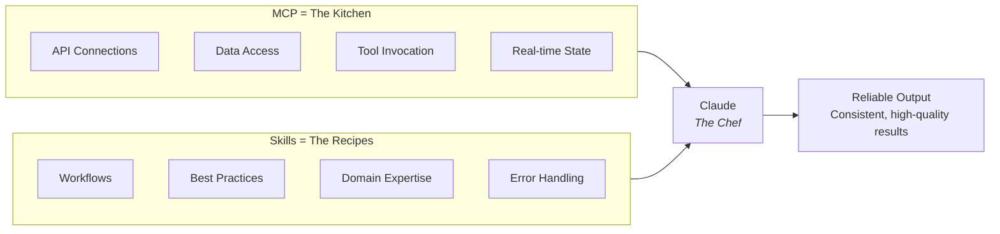

> **Speaking Notes:**
> "The diagram uses a cooking metaphor that makes this click.
>
> On the left — **MCP is the Kitchen.** It provides four types of capabilities: API connections to external services, data access to databases and files, tool invocation for running commands, and real-time state from live systems. MCP gives the agent _capabilities_ — what it _can_ do.
>
> On the right — **Skills are the Recipes.** They encode workflows, best practices, domain expertise, and error handling. Skills tell the agent _how_ to use those capabilities effectively.
>
> Both feed into the chef — Claude or any agent — and produce reliable, consistent output.
>
> Without skills, teams connect an MCP server and ask 'now what?' The agent has tools but no guidance. With skills, workflows activate automatically based on the query. The kitchen is useless without recipes."

---

## Appendix D: Copilot vs. Devin — Two Architectures

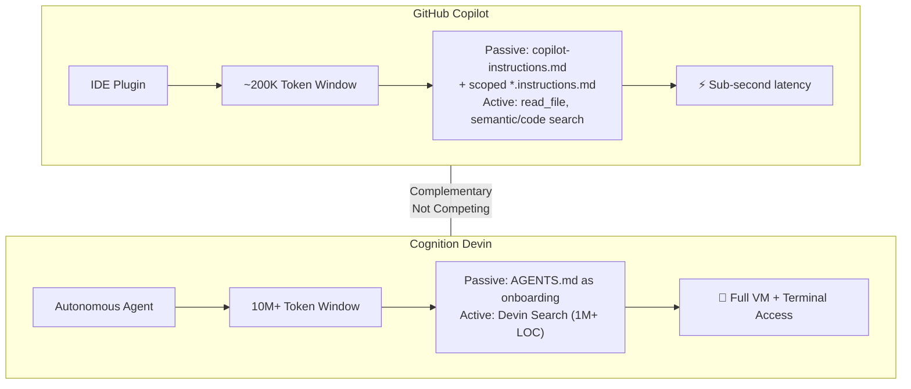

> **Speaking Notes:**
> "The diagram compares two leading tools side by side.
>
> **GitHub Copilot** — top row. It's an IDE plugin with a ~200K token context window. For context loading, it uses _passive_ injection via copilot-instructions.md and scoped `*.instructions.md` files, plus _active_ tools like read_file and semantic/code search. Key advantage: sub-second latency. It's your surgical, always-available pair programmer.
>
> **Cognition Devin** — bottom row. It's a fully autonomous agent with a 10M+ token window. It reads AGENTS.md as an onboarding document and uses Devin Search to index over a million lines of code. Key advantage: it has a full VM with terminal access — it can run your build, execute tests, even deploy.
>
> The link between them says 'Complementary, Not Competing.' Copilot handles the quick, inline tasks. Devin handles multi-file refactors and complex multi-step work. Both read AGENTS.md — the same context files serve both architectures."

---

## Appendix E: Monorepo Routing — Nearest-File Precedence

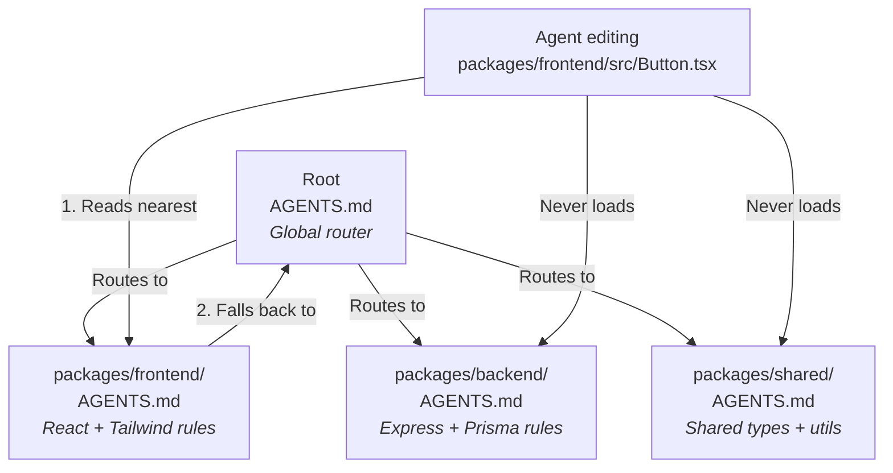

> **Speaking Notes:**
> "The diagram shows exactly how file resolution works in a monorepo.
>
> At the top — the **root AGENTS.md** acts as a global router. It routes to three package-level AGENTS.md files: frontend (React + Tailwind rules), backend (Express + Prisma rules), and shared (types + utils).
>
> Now watch what happens when an agent edits `packages/frontend/src/Button.tsx`. Step 1: it reads the _nearest_ AGENTS.md — that's `packages/frontend/AGENTS.md` with React-specific rules. Step 2: it falls back to the root AGENTS.md for global conventions.
>
> The crossed-out arrows are the key insight: the agent _never loads_ the backend or shared AGENTS.md files. Zero context leakage between domains. Your Python backend conventions don't pollute your React frontend context, and vice versa. Each package gets exactly the rules it needs and nothing more."

---

## Appendix F: The Hybrid Strategy Stack

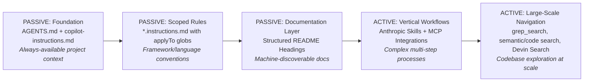

> **Speaking Notes:**
> "The diagram shows the full strategy stack — five layers, bottom to top. Build from the foundation up.
>
> **Layer 1 — Passive Foundation.** AGENTS.md plus copilot-instructions.md. Always-available project context injected into every prompt. This is where you start.
>
> **Layer 2 — Passive Scoped Rules.** Your `framework.instructions.md` files with `applyTo` globs. Framework and language conventions that activate only for matching file types.
>
> **Layer 3 — Passive Documentation.** Structured README headings that make your docs machine-discoverable. Agents can parse `##` headings to find relevant sections.
>
> **Layer 4 — Active Vertical Workflows.** Anthropic Skills plus MCP integrations for complex, multi-step processes like code review pipelines or database migrations.
>
> **Layer 5 — Active Large-Scale Navigation.** Tools like grep_search, semantic/code search, and Devin Search for exploring large codebases at scale.
>
> Most teams only need Layers 1 and 2 to see massive improvements. Layers 3–5 are for mature teams scaling to complex workflows."

---

## Appendix G: The Passive Steering Workflow


> **Speaking Notes:**
> "This sequence diagram shows exactly what happens under the hood when passive steering works.
>
> The developer opens `Button.tsx` in their IDE. The IDE notifies the context engine that a file matching `**/*.tsx` was opened.
>
> The context engine silently assembles the passive load set — four files: AGENTS.md from the repo root, copilot-instructions.md for global standards, react.instructions.md matched by the tsx glob, and the nearest package-level AGENTS.md. All four get merged and injected into the agent's system prompt.
>
> Now the developer types: 'Add a loading state to this button.' By the time that request reaches the agent, every convention is already in context — React functional components, TypeScript interfaces, your UI library, your naming patterns.
>
> The agent responds with correct, convention-compliant code. No searching. No guessing. No decision point where it could skip your docs. That's the power of passive steering."

---

## Appendix H: The Complete Context Architecture

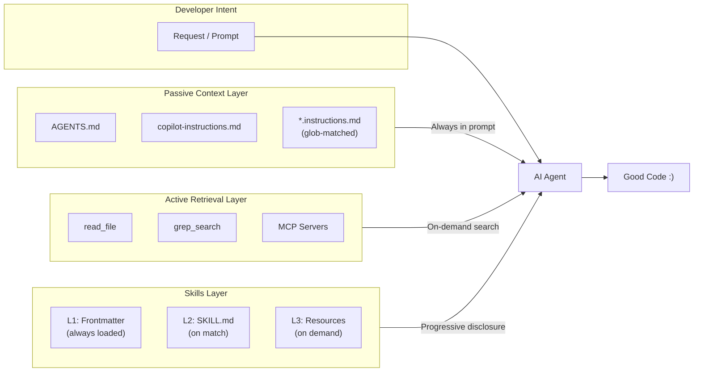

> **Speaking Notes:**

> (Right side of slide) Good Code = Deterministic Framework-Aligned Convention-Compliant Code

> "This diagram is the big picture — everything we've discussed in one view.
>
> At the top left, the developer's request flows into the AI agent. Three context layers feed into the agent simultaneously.
>
> **The Passive Context Layer** — AGENTS.md, copilot-instructions.md, and glob-matched `framework.instructions.md` files. These are labeled 'Always in prompt' because they're injected every single turn. No decision point, no chance of being skipped.
>
> **The Active Retrieval Layer** — read_file, grep_search, semantic/code search, and MCP servers. These are 'On-demand search' — the agent decides when to use them. Powerful but unreliable as a sole strategy.
>
> **The Skills Layer** — three progressive levels from Anthropic's framework. L1 frontmatter is always loaded, L2 SKILL.md loads on match, L3 resources load on demand. This is 'Progressive disclosure' — scaling to hundreds of workflows without token bloat.
>
> All three layers converge on the agent, which produces the output at the right: deterministic, framework-aligned, convention-compliant code. That's the architecture of context engineering."

---

## Appendix I: Example Failure Composition

```mermaid
pie title "Example Failure Composition"
    "Context Blindness (no grounded context)" : 44
    "Decision Gap (didn't search)" : 23
    "Context Rot (window overflow)" : 18
    "Hallucination (parametric error)" : 15
```

> **Speaking Notes:**
> "The pie chart shows an example failure composition for coding agents.
>
> The biggest slice — **44% is Context Blindness.** The agent had no grounded context at all. No AGENTS.md, no instructions files, nothing. It guessed based purely on training data and got it wrong. This is the kind of failure that passive context files directly address.
>
> **23% is the Decision Gap.** The context _existed_ somewhere in the repo, but the agent decided not to search for it. It thought it already knew the answer. This is related to the 'agents skip docs 44% of the time' problem from Vercel's data.
>
> **18% is Context Rot.** The agent _had_ the right context earlier in the conversation, but as the window filled up, auto-compaction discarded it. The four-zone diagram from Appendix A explains this.
>
> **15% is true Hallucination.** Parametric knowledge error — the model's training data was simply wrong. This is the only category that context files can't fix.
>
> The key insight is directional rather than precise: Context Blindness and the Decision Gap are both areas where passive steering helps, and Context Rot is another area that structured files can mitigate."

---

## Appendix J: Context File Impact by Scenario

```mermaid
quadrantChart
    title Context Files: When They Help Most
    x-axis "Low Specificity" --> "High Specificity"
    y-axis "In Training Data" --> "NOT in Training Data"
    quadrant-1 "CRITICAL"
    quadrant-2 "Helpful"
    quadrant-3 "Low Impact"
    quadrant-4 "Moderate"
    "New APIs (Vercel)": [0.8, 0.9]
    "SWE-BENCH tasks": [0.3, 0.25]
    "CRUD ops": [0.15, 0.15]
    "Monorepo rules": [0.75, 0.7]
```

> **Speaking Notes:**
> "This quadrant chart reconciles the Vercel and ETH Zürich results. Two axes: x-axis is project specificity (low to high), y-axis is whether the knowledge exists in training data (bottom) or not (top).
>
> **Top-right quadrant — CRITICAL.** High specificity, not in training data. 'New APIs (Vercel)' sits here at [0.8, 0.9]. This is where AGENTS.md has maximum impact — the agent has never seen these APIs before and the project has specific conventions around them. This is exactly what Vercel tested.
>
> **Top-left — Helpful.** Low specificity but not in training data. General new patterns the model hasn't encountered.
>
> **Bottom-right — Moderate.** 'Monorepo rules' sits at [0.75, 0.7]. High specificity but partially in training data — the model knows _about_ monorepos but not _your_ specific routing rules.
>
> **Bottom-left — Low Impact.** 'CRUD ops' at [0.15, 0.15] and 'SWE-BENCH tasks' at [0.3, 0.25]. Generic tasks on well-known patterns. The model already knows how to do these. This is what ETH Zürich mostly tested, which explains their marginal results.
>
> Takeaway: invest your AGENTS.md effort in top-right quadrant knowledge — the tribal, project-specific stuff the model has never seen."

---

## Appendix K: Full Presentation Timeline

```mermaid
flowchart LR
    P["PRACTICAL (7 min)<br/>• Title & Hook (1)<br/>• Essential Files (2)<br/>• AGENTS.md Content (1)<br/>• 15-Min Audit (2)<br/>• Example Repo (1)"]
    W["THE WHY (5 min)<br/>• Parametric vs Grounded (1.5)<br/>• Passive vs Active (2)<br/>• Research Snapshot (1.5)"]
    C["CLOSE (3 min)<br/>• Five Pillars (1)<br/>• Maturity + CTA (2)"]
    Q["Q&A (5+ min)"]

    P --> W --> C --> Q
```

> **Speaking Notes:**
> "The timeline shows the full talk structure — four blocks flowing left to right.
>
> **Practical — 7 minutes.** This is the 'what to do' section. Title and hook to set the problem (1 min). The essential files overview (2 min). What goes inside AGENTS.md (1 min). The 15-minute audit walkthrough (2 min). And the example repo to make it concrete (1 min). By the 7-minute mark, the audience knows exactly what to do and how to do it.
>
> **The Why — 5 minutes.** This is the 'why it works' section. Parametric vs grounded knowledge explains the mechanism (1.5 min). Passive vs active context with Vercel's data proves passive wins (2 min). Research snapshot gives honest nuance with ETH Zürich's counterpoint (1.5 min).
>
> **Close — 3 minutes.** Five pillars provide the architecture framework (1 min). Maturity model and call to action gives concrete next steps across three time horizons (2 min).
>
> **Q&A — 5+ minutes.** Open floor. The appendix slides are available for deep-dive questions on specific topics.
>
> Total: 15 minutes of content designed for a 20-minute slot."

_Tech Talk: "Context Engineering: Building AI-Native Repositories" — ~15 minutes with 11 main slides + 11 appendix slides, 20+ Mermaid diagrams. Designed for Q&A time._
