# Context Engineering: Building AI-Native Repositories

## A 15-Minute Engineering Tech Talk (+ Q&A)

**Speaker Notes Format:** Each slide section includes timing, speaking notes, and Mermaid diagrams ready for live rendering.

---

## Slide 1: Title — "Your Repo Is Fighting Your AI Agents" _(1 min)_

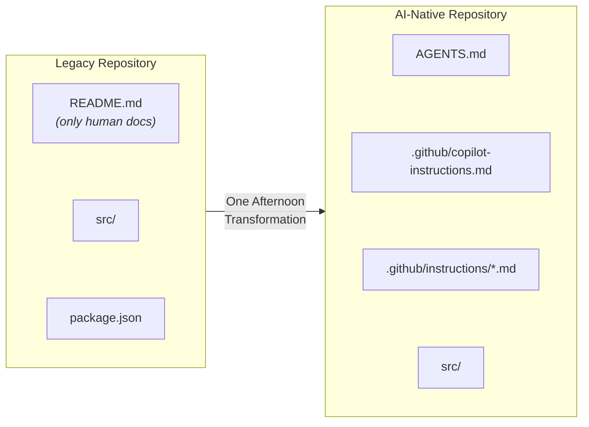

> **Speaking Notes:**
> "How many of you use Copilot or another AI coding agent daily? And how often does it get things _wrong_ — compiles fine, but violates your conventions?
>
> Look at the diagram. On the left — a legacy repository. README.md written for humans, your source code, package.json. That's what 70% of repos look like today. On the right — an AI-native repository. Three files added: AGENTS.md at the root, copilot-instructions.md for global standards, and scoped instruction files for framework-specific rules. Same source code, same project — just a few files that tell the agent how your team actually works.
>
> Vercel measured this: legacy repos get 53% task success. Add those files and you hit 100%. The transformation takes one afternoon. Today I'll show you exactly which files to add, what to put in them, and you can do it before your next standup."

---

## Slide 2: The Essential Files — Your AI Agent Toolkit _(2 min)_


> **Speaking Notes:**
> "Four files — that's the toolkit. Let me walk through each one.
>
> First, **AGENTS.md** — this lives at your repo root. It's the single most impactful file you can add. Every major AI coding agent reads it: GitHub Copilot, Devin, Cursor, Windsurf. Think of it as your project's instruction manual for AI — setup commands, conventions, pitfalls. Vercel proved this one file alone took task success from 53% to 100%.
>
> Second, **copilot-instructions.md** — this lives at `.github/copilot-instructions.md`. GitHub Copilot specifically looks for this file and always injects it into the system prompt. Use it for global coding standards that apply everywhere: naming conventions, import ordering, error handling patterns.
>
> Third, **scoped instruction files** — these are `.instructions.md` files inside `.github/instructions/`. Each one has an `applyTo` glob pattern. So you can have `react.instructions.md` with `applyTo: '**/*.tsx'` for React conventions, and `python.instructions.md` with `applyTo: '**/*.py'` for Python rules. The agent only loads the rules relevant to the file you're editing.
>
> Fourth, **Skills and Prompts** — these live in `.github/skills/` and `.github/prompts/`. Skills are multi-step workflows the agent can execute — like 'run a code review' or 'scaffold a new API endpoint.' Prompts are team-shared templates so everyone asks the agent the same way. These are your reusable building blocks.
>
> Together, these four files give the agent everything it needs. Let me show you what goes inside each one."

---

## Slide 3: What Goes in AGENTS.md _(1 min)_

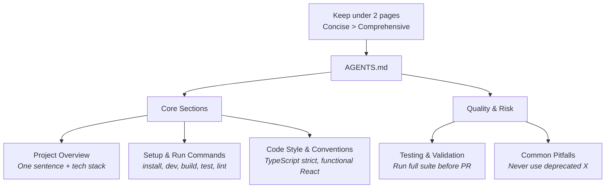

> **Speaking Notes:**
> "What goes in AGENTS.md? The diagram breaks it into two groups.
>
> **Core sections** — the essentials. First, a one-sentence project overview with your tech stack. Second, setup and run commands — install, dev, build, test, lint — in execution order so the agent can actually run your project. Third, code style and conventions — things like 'TypeScript strict mode, functional React components only.'
>
> **Quality and risk sections** — these save you from the subtle bugs. Testing and validation — 'run the full suite before any PR.' And common pitfalls — 'never use the deprecated X API, always use Y instead.'
>
> The rule at the top matters most: keep it under two pages. Vercel proved that a compressed 8KB index beat 40KB of full documentation. Why? Because concise context stays in the attention window. Verbose context gets compressed away. Encode your _tribal knowledge_ — the non-obvious stuff that burns people — and leave out anything the agent already knows from training data."

---

## Slide 4: The 15-Minute Audit _(2 min)_

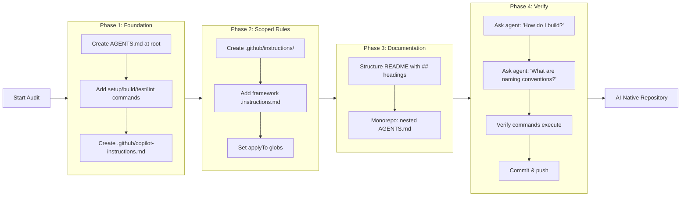

> **Speaking Notes:**
> "Here's your action plan — you can literally do this during lunch. The diagram shows four phases flowing left to right.
>
> **Phase 1: Foundation.** Create AGENTS.md at your repo root. Add your setup, build, test, and lint commands. Then create `.github/copilot-instructions.md` with your global coding standards. That's three files in five minutes.
>
> **Phase 2: Scoped Rules.** Create a `.github/instructions/` directory. Add framework-specific `.instructions.md` files — one for React, one for Python, whatever you use. Set the `applyTo` glob patterns so each file only activates for the right file types.
>
> **Phase 3: Documentation.** Structure your README with machine-readable `##` headings. If you have a monorepo, add a nested AGENTS.md in each package directory.
>
> **Phase 4: Verify.** This is the step people skip — don't. Ask your agent: 'How do I build this project?' Ask it: 'What are our naming conventions?' Verify the commands actually execute. If the answers are right, commit and push. You're done — your repo is now AI-native."

---

## Slide 5: Example Repo in Action — "acme-webapp" _(1 min)_

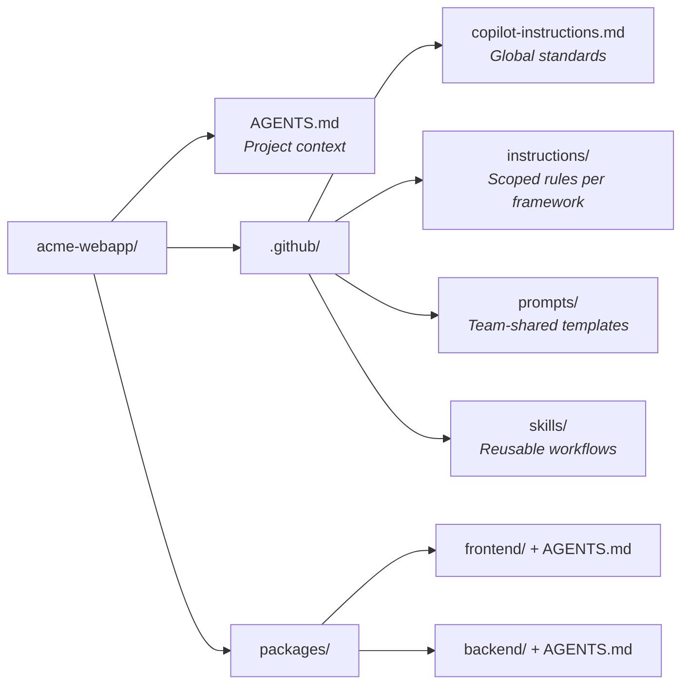

> **Speaking Notes:**
> "Here's what this looks like in a real repo. This is 'acme-webapp' — a typical monorepo. At the root: AGENTS.md with your project overview and commands. In .github: copilot-instructions.md for global standards, scoped instruction files for React and Python, pre-made prompts your whole team can share, and a skills folder for reusable agent workflows — things like 'run-code-review' or 'migrate-database'. Each package has its own AGENTS.md for domain-specific rules. The .github folder is the right home for these — it works across Copilot, Windsurf, Cursor, and any other agent that follows the spec."

---

## Slide 6: Parametric vs. Grounded Knowledge — Why This Works _(1.5 min)_

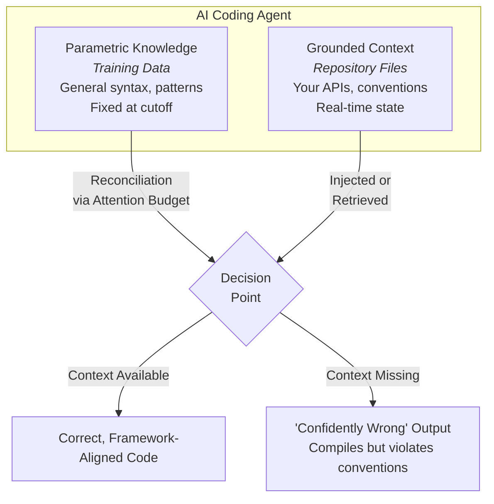

> **Speaking Notes:**
> "Now you know _what_ to do — let me explain _why_ it works. Every AI agent has two knowledge sources. _Parametric_ — what it learned in training. _Grounded_ — what's in your repo right now. Your private APIs, your naming conventions — none of that is in the training data. When agents can't find grounded context, they guess _confidently_. The files we just set up provide that grounded context so the agent stops guessing."

---

## Slide 7: Passive vs. Active Context — Why Passive Wins _(2 min)_

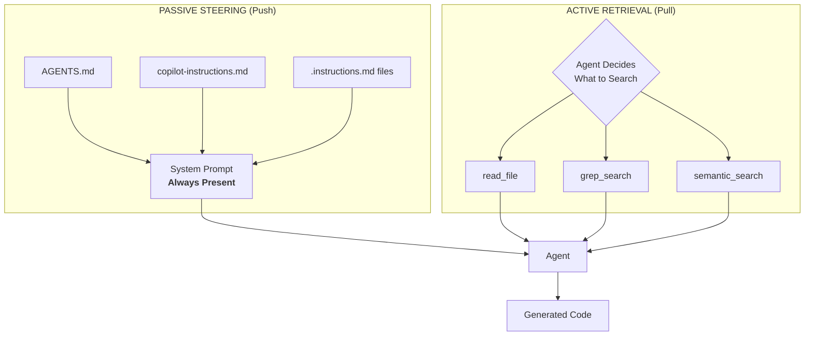

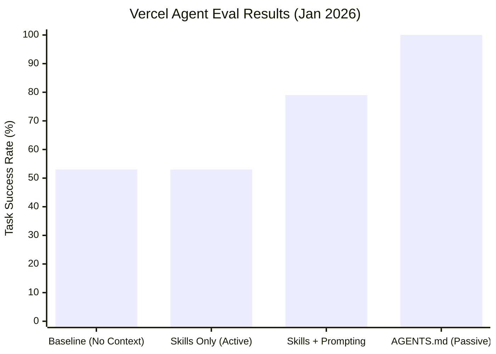

> **Speaking Notes:**
> "There are two ways to get context to an agent, and the diagram on the left shows both.
>
> **Passive steering** — the push model. Your AGENTS.md, copilot-instructions.md, and scoped .instructions.md files all get injected directly into the system prompt. They're _always present_. The agent doesn't choose to load them — they're just there.
>
> **Active retrieval** — the pull model. The agent decides to search using tools like `read_file`, `grep_search`, or `semantic_search`. The critical word is _decides_. There's a decision point, and Vercel found that agents skip searching **44% of the time** because they think they already know the answer.
>
> Now look at the bar chart on the right — this is Vercel's actual eval data from January 2026. Baseline with no context files: 53% task success. Skills only — that's pure active retrieval — same 53%. Skills with explicit prompting: 79%. But a compressed 8KB AGENTS.md injected passively into the prompt? **100% success rate.**
>
> The takeaway is clear: passive removes the decision point entirely. The agent can't skip what's already in its prompt."

---

## Slide 8: Research Snapshot — What the Data Says _(1.5 min)_

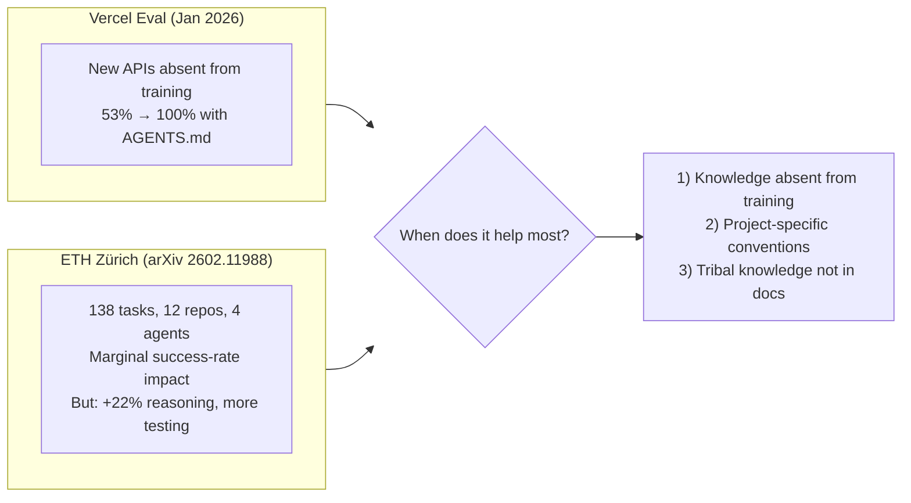

> **Speaking Notes:**
> "Let's be honest about the research — the diagram shows both sides.
>
> On the left, **Vercel's eval** from January 2026: they tested new APIs that were absent from the model's training data. Result: 53% baseline jumped to 100% with AGENTS.md. Dramatic.
>
> On the right, **ETH Zürich's rigorous study** — 138 tasks across 12 repos with 4 different agents. They found marginal success-rate impact. But here's the nuance: they saw +22% improvement in reasoning quality and agents wrote more tests.
>
> The diamond in the middle is the reconciliation: _when does it help most?_ Three conditions — first, when knowledge is absent from training data. Second, when you have project-specific conventions the model has never seen. Third, when there's tribal knowledge that's not in any documentation.
>
> Practical takeaway: don't auto-generate AGENTS.md with an LLM — those are redundant with what's already in the training data. Write it yourself. Encode the stuff that burns people — the non-obvious decisions, the 'we tried X and it broke everything' knowledge. That's where the ROI is."

---

## Slide 9: The Five Pillars of AI-Native Repos _(1 min)_

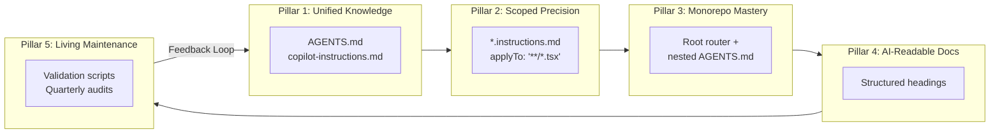

> **Speaking Notes:**
> "Five pillars frame the whole approach. **Unified Knowledge** — AGENTS.md plus copilot-instructions. **Scoped Precision** — glob-matched rules per framework. **Monorepo Mastery** — nested files with nearest-file precedence. **AI-Readable Docs** — structured headings. **Living Maintenance** — quarterly audits. You already know how to do the first three from the audit slide. Pillars 4 and 5 are your this-week and this-month work."

---

## Slide 10: Maturity Model & Call to Action _(2 min)_

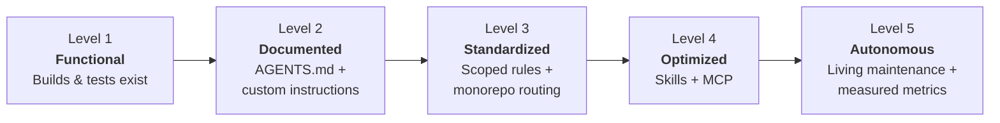

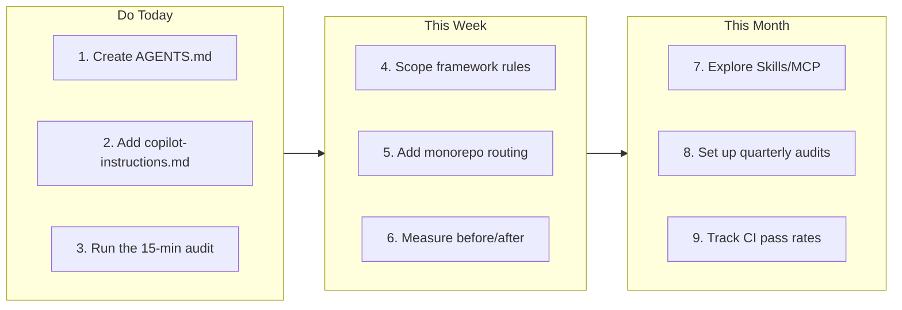

> **Speaking Notes:**
> "Where is your repo today? The maturity model shows five levels.
>
> **Level 1: Functional** — your project builds and tests exist. That's most teams right now. **Level 2: Documented** — you've added AGENTS.md and custom instructions. That takes 15 minutes. **Level 3: Standardized** — scoped rules per framework plus monorepo routing. An afternoon of work. **Level 4: Optimized** — you're using Skills and MCP integrations. **Level 5: Autonomous** — living maintenance with measured metrics and quarterly audits.
>
> The biggest ROI jump is from Level 1 to Level 3 — and you can get there today.
>
> The second diagram breaks it into three time horizons with specific action items. **Today, 15 minutes:** create AGENTS.md, add copilot-instructions.md, run the audit from slide 4. **This week:** scope your framework rules with glob patterns, add monorepo routing if applicable, and measure before/after on a real task. **This month:** explore Skills and MCP for advanced workflows, set up quarterly audits to keep files current, and start tracking CI pass rates as your success metric.
>
> The difference is night and day. Questions?"

---

## Slide 11: References

> (No diagram — text-only slide)

- **Vercel Blog:** _AGENTS.md outperforms skills in our agent evals_ (Jan 27, 2026) — https://vercel.com/blog/agents-md-outperforms-skills-in-our-agent-evals
- **arXiv 2602.11988:** _Evaluating AGENTS.md: Are Repository-Level Context Files Helpful for Coding Agents?_ — https://arxiv.org/abs/2602.11988
- **AGENTS.md Official Specification** — https://agents.md/
- **GitHub Docs:** _Adding custom instructions for GitHub Copilot_ — https://docs.github.com/copilot/customizing-copilot/adding-custom-instructions-for-github-copilot
- **Anthropic:** _The Complete Guide to Building Skills for Claude_ — https://platform.claude.com/docs/en/agents-and-tools/agent-skills/best-practices
- **GitHub Blog:** _How to write a great agents.md_ — https://github.blog/ai-and-ml/github-copilot/how-to-write-a-great-agents-md-lessons-from-over-2500-repositories/

---

## Appendix A: Context Rot — The Silent Killer

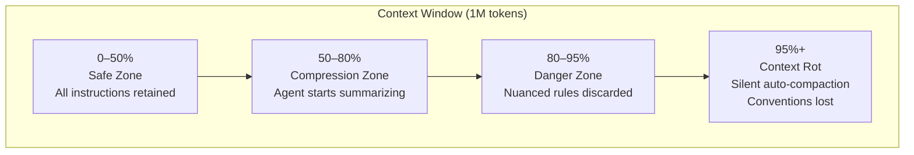

> **Speaking Notes:**
> "Even with million-token context windows, there's a ticking time bomb: _context rot_. As the window fills, agents silently auto-compact. Your project conventions — the first things discarded. The agent doesn't tell you. The code compiles. Tests might pass. But it violates your architecture. This is why we need _structured_ context, not just throwing everything into the window."

---

## Appendix B: Anthropic's Progressive Disclosure

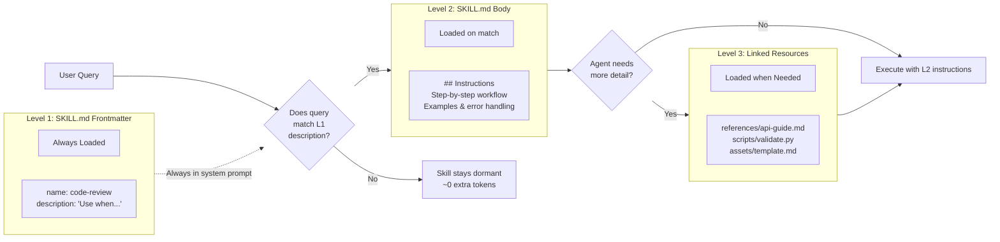

> **Speaking Notes:**
> "Anthropic's Skills framework is the gold standard for progressive disclosure. Level 1 — just the YAML frontmatter, about 100 tokens — is _always_ in the system prompt. Level 2 — the full SKILL.md body — loads only on match. Level 3 — reference files — load on demand. Hundreds of skills, minimal token overhead."

---

## Appendix C: MCP + Skills Architecture

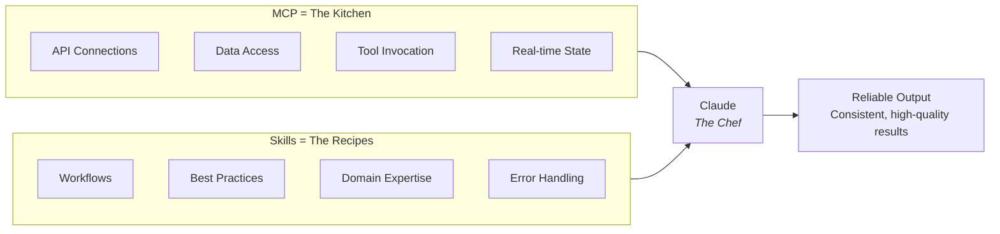

> **Speaking Notes:**
> "MCP gives you the kitchen — tools, ingredients, equipment. Skills give you the recipes. Without skills, users connect an MCP and ask 'now what?' With skills, workflows activate automatically."

---

## Appendix D: Copilot vs. Devin — Two Architectures


> **Speaking Notes:**
> "Two leading tools, two philosophies. Copilot is the _silent partner_ — low latency, IDE-native. Devin is the _autonomous engineer_ — full VM, indexes your entire codebase. They're complementary. Both read AGENTS.md."

---

## Appendix E: Monorepo Routing — Nearest-File Precedence

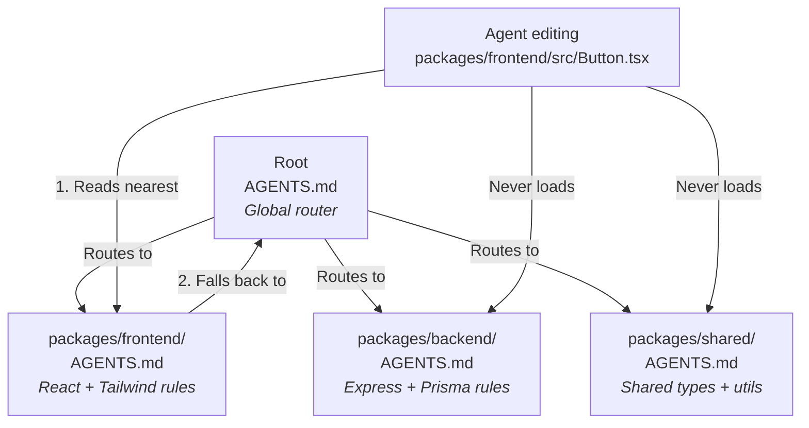

> **Speaking Notes:**
> "In monorepos, nearest-file precedence is everything. The root AGENTS.md acts as a router. Each package has its own. Zero context leakage between domains."

---

## Appendix F: The Hybrid Strategy Stack

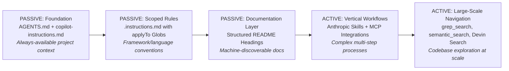

> **Speaking Notes:**
> "Five layers from foundation to large-scale navigation. Build from the bottom up. Most teams only need the first two layers to see massive improvements."

---

## Appendix G: The Passive Steering Workflow


> **Speaking Notes:**
> "Developer opens a TSX file. The context engine silently matches globs, loads the nearest AGENTS.md, merges everything. By the time the developer types a request, the agent already has every convention. No searching. No guessing."

---

## Appendix H: The Complete Context Architecture

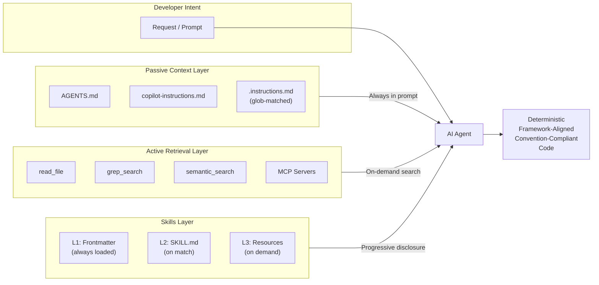

> **Speaking Notes:**
> "The complete architecture: three layers feeding into the agent. Passive context — always in the prompt. Active retrieval — on-demand. Skills — progressive disclosure. Together: deterministic, convention-compliant code."

---

## Appendix I: Key Metrics Summary

```mermaid
pie title "Where Agent Failures Come From"
    "Context Blindness (no grounded context)" : 44
    "Decision Gap (didn't search)" : 23
    "Context Rot (window overflow)" : 18
    "Hallucination (parametric error)" : 15
```

---

## Appendix J: Context File Impact by Scenario

```mermaid
quadrantChart
    title Context Files: When They Help Most
    x-axis "Low Specificity" --> "High Specificity"
    y-axis "In Training Data" --> "NOT in Training Data"
    quadrant-1 "CRITICAL"
    quadrant-2 "Helpful"
    quadrant-3 "Low Impact"
    quadrant-4 "Moderate"
    "New APIs (Vercel)": [0.8, 0.9]
    "SWE-BENCH tasks": [0.3, 0.25]
    "CRUD ops": [0.15, 0.15]
    "Monorepo rules": [0.75, 0.7]
```

---

## Appendix K: Full Presentation Timeline

```mermaid
flowchart LR
    P["PRACTICAL (7 min)<br/>• Title & Hook (1)<br/>• Essential Files (2)<br/>• AGENTS.md Content (1)<br/>• 15-Min Audit (2)<br/>• Example Repo (1)"]
    W["THE WHY (5 min)<br/>• Parametric vs Grounded (1.5)<br/>• Passive vs Active (2)<br/>• Research Snapshot (1.5)"]
    C["CLOSE (3 min)<br/>• Five Pillars (1)<br/>• Maturity + CTA (2)"]
    Q["Q&A (5+ min)"]

    P --> W --> C --> Q
```

---

## Key Citations

- **Vercel Blog:** _AGENTS.md outperforms skills in our agent evals_ (Jan 27, 2026) — https://vercel.com/blog/agents-md-outperforms-skills-in-our-agent-evals
- **arXiv 2602.11988:** _Evaluating AGENTS.md: Are Repository-Level Context Files Helpful for Coding Agents?_ — https://arxiv.org/abs/2602.11988
- **AGENTS.md Official Specification** — https://agents.md/
- **GitHub Docs:** _Adding custom instructions for GitHub Copilot_ — https://docs.github.com/copilot/customizing-copilot/adding-custom-instructions-for-github-copilot
- **Anthropic:** _The Complete Guide to Building Skills for Claude_ — https://platform.claude.com/docs/en/agents-and-tools/agent-skills/best-practices
- **GitHub Blog:** _How to write a great agents.md_ — https://github.blog/ai-and-ml/github-copilot/how-to-write-a-great-agents-md-lessons-from-over-2500-repositories/

---

_Tech Talk: "Context Engineering: Building AI-Native Repositories" — ~15 minutes with 11 main slides + 11 appendix slides, 20+ Mermaid diagrams. Designed for Q&A time._
